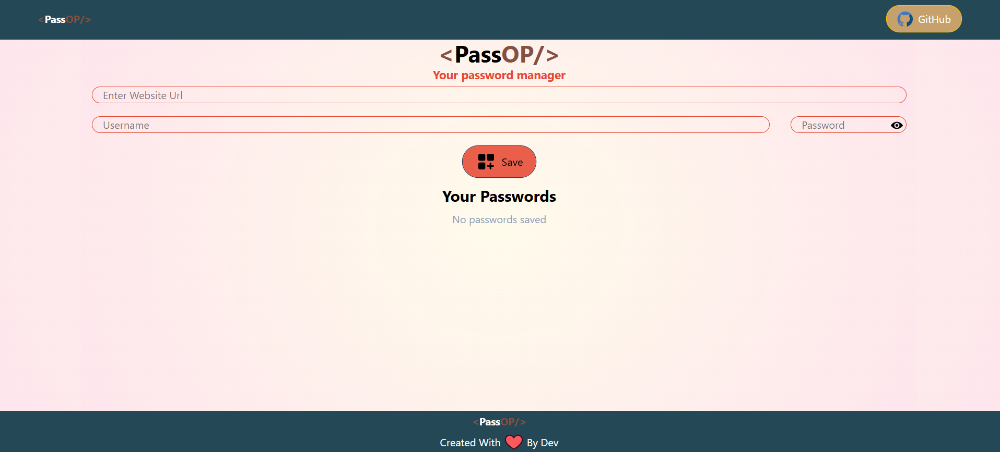

# 🔐 PassOp - Your Own Password Manager

## 📌 Overview
**PassOp** is a secure and user-friendly **password manager** built using **React.js** for the frontend and **MongoDB** for the backend. It allows users to store and manage their credentials securely by saving **site URLs, usernames, and passwords** in an encrypted database.

## 🚀 Features
- 🔑 **Securely store passwords** in an encrypted database.
- 🌐 **Save website URLs**, usernames, and passwords with ease.
- 🔍 **Search and filter saved credentials** quickly.
- 🛡️ **Data encryption for maximum security.**
- 📱 **Responsive UI for all devices.**

## 🛠️ Technologies Used
- **Frontend**: React.js, Tailwind CSS
- **Backend**: Node.js, Express.js
- **Database**: MongoDB
- **Security**: Bcrypt for encryption

## 🎥 Project Screenshot


## 🚀 How to Run the Project
### 1️⃣ Clone the repository
```sh
 git clone https://github.com/DevKumar-web/PassOp - Your-own-password-manager.git
```

### 3️⃣ Install dependencies for both frontend and backend
```sh
 cd client && npm install  # Install frontend dependencies
 cd ../server && npm install  # Install backend dependencies
```
### 4️⃣ Start the development server
```sh
# Start backend server
cd backend
npm start

# Open a new terminal and start frontend
cd client
npm start
```
### 5️⃣ Open in Browser
Go to `http://localhost:3000` to use the app.

## 🌟 Future Enhancements
- 📢 **Add multi-user support with authentication**
- 🔔 **Enable password strength checker**
- ☁️ **Cloud backup option for extra security**
- 🔒 **Two-factor authentication (2FA)**

## 📜 License
This project is licensed under the **MIT License**.

---
🚀 **PassOp: Your Own Password Manager** | Secure, Fast, and Reliable 🔐

